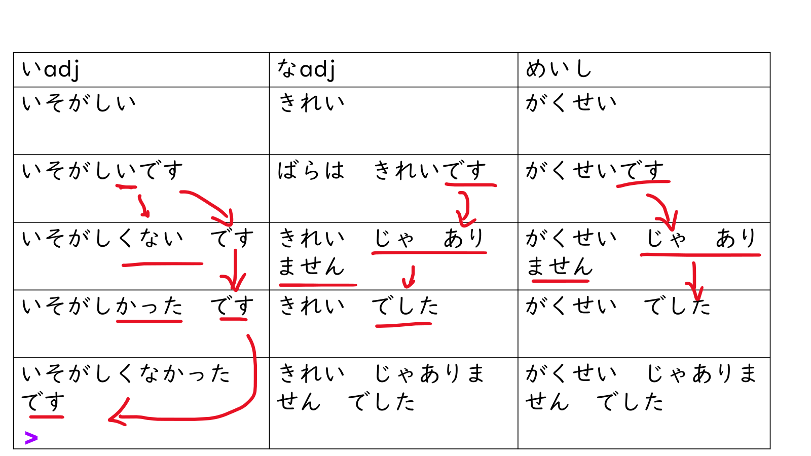

## Rule 1 : Use 「〜が欲しい」 (ga hoshii) with the object you want.

### Noun + 「が」 (ga) + 「ほしい」 hoshi desu --> want something

#### Ex.

- みずが ほしいです。- Mizu ga hoshii desu - I want water.
- りんごが ほしいです。- Ringo ga hoshii desu - I want an apple.

- あたらしい カメラが ほしいです。- Atarashii kamera ga hoshii desu. - I want a new camera.

- スーパーで アイスクリームが ほしいです。 - Sūpā de aisukurīmu ga hoshii desu.- I want ice cream at the supermarket.

- なにが ほしいですか。 - Nani ga hoshii desu ka. - What do you want?

## Rule 2 : Attach 「〜たい」 (tai) to the stem of the verb, which is the masu-form without 「ます」

### Verb( masu stem) +「たい」 + desu --> want to do something

- 日本（にほん）に行（い）きたいです。 - Nihon ni ikitai desu.- I want to go to Japan.

- コーヒーが飲（の）みたいです。- Kōhī ga nomitai desu.- I want to drink coffee.

- 映画（えいが）が見（み）たいです。- Eiga ga mitai desu. - I want to see a movie.

- パソコンが買いたいです。- Pasokon ga kaitai desu.- I want to buy a computer

